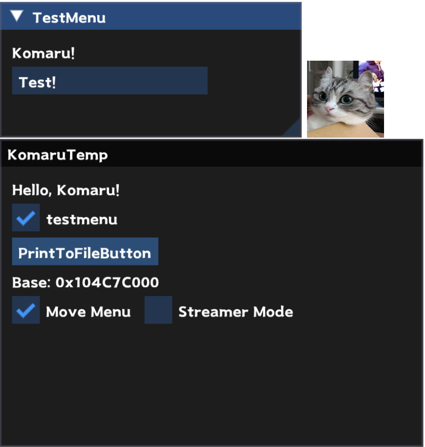

# iOS-Theos-ModMenuTemp-NoJB

A Theos-based iOS mod menu template using Dear ImGui, KMem, and Titanox.

## Template Preview



## Architecture



## KMem

[KMem](https://github.com/VenerableCode/KMem-iOS) is a simple lightweight header-only mach memory utility file, also a learning project of mine.

### Usage

#### Find the First Base

Find the first base:

```cpp
uintptr_t base = KMEM::scanner::FindFirstBase();
```

#### Return Base

Reinterpret cast `_dyld_get_image_header(0)`:

```cpp
uintptr_t base = KMEM::scanner::ReturnBase();
```

#### Get Base From Name

```cpp
uintptr_t base = KMEM::scanner::GetImageBase("UnityFramework");
```

#### Get Address From First Base + Offset

Only works if `FindFirstBase` is successful:

```cpp
uintptr_t address = KMEM::io::GetAddress(0x123);
```

#### Get Address From Chosen Base + Offset

```cpp
uintptr_t address = KMEM::io::GetAddress("framework", 0x123);
```

#### Validate Pointer

```cpp
if (KMEM::io::IsValidPointer(address)) { }
```

#### Read

```cpp
int value = KMEM::io::ReadMem<int>(address);
```

#### Write

```cpp
KMEM::io::WriteMem<int>(address, 100);
```

#### Read String

```cpp
std::string text = KMEM::io::ReadString(address, 64);
```

#### Raw Read

```cpp
uintptr_t rawValue = KMEM::io::ReadRaw(address);
```

#### Raw Write

```cpp
KMEM::io::WriteRaw<int>(address, 100);
```

#### Read Bytes

```cpp
uint8_t buffer[32]{};
KMEM::io::ReadBytes(address, buffer, sizeof(buffer));
```

#### Write Bytes

```cpp
const uint8_t bytes[] = { 0x90, 0x90, 0x90 };
KMEM::io::WriteBytes(address, bytes, sizeof(bytes));
```

## Titanox

[Titanox](https://github.com/Ragekill3377/Titanox) is the hooking framework used by the template.

## MemX

[MemX-Jailed](https://github.com/Aethereux/MemX-Jailed) is a separate memory manipulation and VMT hooking util used by Titanox. 

## Mystic XOR

[Mystic-xorstr](https://github.com/wufhex/Mystic-xorstr) is a C++17 header-only library providing compile-time string and integer encryption.


### Usage

Strings can be encrypted at compile time using `MYSTIFY`:

```cpp
auto text = MYSTIFY("Hello World");
```

## Project Structure

```text
iOS-Theos-ModMenuTemp-NoJB/
├── docs/
│   ├── architecture.svg
│   └── KTempPreview.png
│
├── ImGui/
│   ├── imconfig.h
│   ├── imgui.cpp
│   ├── imgui.h
│   ├── imgui_draw.cpp
│   ├── imgui_widgets.cpp
│   ├── imgui_tables.cpp
│   ├── imgui_demo.cpp
│   ├── imgui_internal.h
│   ├── imgui_impl_metal.h
│   ├── imgui_impl_metal.mm
│   └── ...
│
├── MenuLoad/
│   ├── Includes.h
│   ├── MenuLoad.h
│   ├── MenuLoad.mm
│   ├── ImGuiDrawView.h
│   ├── ImGuiDrawView.xm
│   ├── TextInput.h
│   └── GUI/
│       ├── UserMenu.h
│       └── UserMenu.mm
│
├── Resources/
│   └── Fonts/
│       └── Font.h
│
├── Source/
│   ├── BasicHacks.h
│   ├── BasicHacks.mm
│   └── Engines/
│
├── utils/
│   ├── Komaru/
│   │   ├── KLog.hpp
│   │   ├── KLog.mm
│   │   └── KMem.h
│   │
│   ├── Math/
│   │   ├── Common/
│   │   ├── Unity/
│   │   └── Unreal/
│   │
│   ├── Wizardry/
│   │   └── mystic.hh
│   │
│   └── libtitanox/
│       ├── MemX/
│       ├── brk_hook/
│       ├── fishhook/
│       ├── mempatch/
│       ├── static-inline-hook/
│       ├── vm_funcs/
│       ├── utils/
│       ├── Makefile
│       └── README.md
│
├── packages/
├── Makefile
├── control
├── ktemp.plist
└── .gitignore
```

## Credits

This project makes use of the following open-source projects:

- [Dear ImGui](https://github.com/ocornut/imgui) - graphical user interface
- [KMem](https://github.com/VenerableCode/KMem-iOS) - memory utilities
- [Titanox](https://github.com/Ragekill3377/Titanox) - hooking framework and runtime utilities
- [MemX-Jailed](https://github.com/Aethereux/MemX-Jailed) - memory manipulation and VMT functionality used by Titanox
- [Mystic-xorstr](https://github.com/wufhex/Mystic-xorstr) - compile-time string and integer encryption
- [FishHook](https://github.com/facebook/fishhook) - symbol rebinding functionality used by Titanox

All respective projects remain the property of their original authors.
